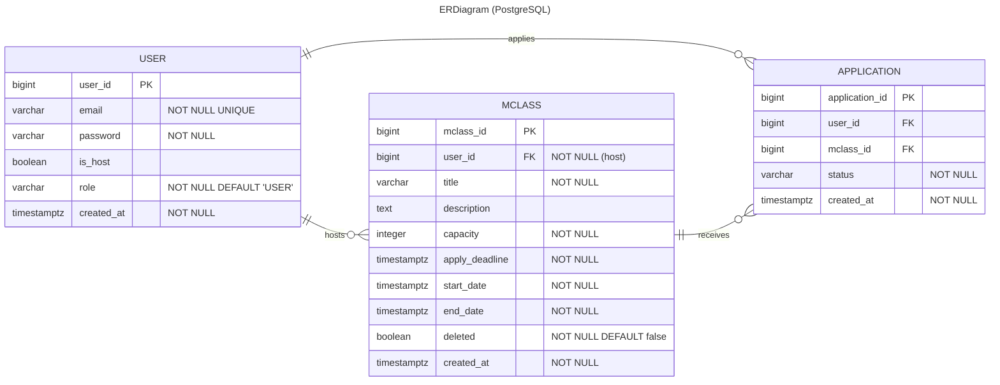

# miniintern

미니인턴

---

# 기능흐름도

### 유저

- 회원가입 흐름

1. 사용자가 회원가입 버튼 클릭
1. 이메일 입력
   1. 서버에서 중복 이메일 확인
      - 이미 등록된 이메일 -> 에러 메시지 반환 ("이미 가입된 이메일입니다.")
   1. 인증 코드 발송
1. 사용자에게 인증 코드 입력 받음
   1. 서버에서 인증 코드 검증
      - 코드가 만료됨 -> 에러 메시지 반환 ("코드가 만료되었습니다.")
      - 코드 불일치 -> 에러 메시지 반환 ("코드가 일치하지 않습니다.")
1. 비밀번호 입력
1. '회원가입' 버튼 클릭 -> 최종 제출
   1. 서버에서 입력값 유효성 검증
      - 비밀번호 기준 미달 -> 에러 메시지 반환
   1. DB에 사용자 정보 저장
1. 성공 응답 반환 (userId 또는 token 등)

 

- 로그인

1. 사용자가 로그인 버튼 클릭을통해 페이지 진입
1. 이메일 비밀번호 입력
   1. 이메일과 비밀번호가 일치하는 유저가 없으면
      - 에러메시지 반환 ("계정정보가 일치하지 않습니다")
1. 성공 응답 반환 (jwt발급)

- 유저 정보 수정
- 유저 삭제
- 호스트 등록

### M클래스

- 내 신청 내역 조회

1. [내 정보] 페이지에서 [M클래스 신청 내역 조회]를 클릭한다.
1. 아래 중 한 가지 상태를 선택하여 필터링한다. (단일 선택 가능)
   - 전체
   - 대기 중
   - 합격 ∙ 진행 중 ∙ 종료
   - 불합격 ∙ 불참
   - 취소 ∙ 환불
1. 선택한 상태 조건에 맞는 M클래스 목록이 조회된다.
   - 목록은 신청일 기준 **(최근 신청 → 오래된 순)** 으로 정렬된다.

 

- M클래스 생성

1. 호스트만 접근할 수 있는 [M클래스 생성] 버튼을 클릭한다.
   - 호스트가 아닌 유저가 접근하게 된다면
     - 에러 메세지 반환("호스트만 M클래스를 생성할 수 있습니다")
1. M클래스 정보 입력 폼이 나타난다.
1. 필수 정보 입력 (예: 클래스명, 설명, 모집 인원, 클래스 시작/종료일, 모집 시작/마감일, 선발방식)
1. [생성] 버튼 클릭
1. 서버에서 입력값 유효성 검증
   - 필수값 누락 시 에러 메시지 반환("xx 값은 비어있을 수 없습니다")
   - 날짜/인원 등 형식 오류 시 에러 메시지 반환("필드명:xx에 잘못된 형식의 값이 들어왔습니다")
1. DB에 M클래스 정보 저장
1. 성공 응답 반환 및 M클래스 목록에 신규 클래스 표시

 

- M클래스 목록 조회

1. M클래스 화면 진입
1. M클래스 목록 조회
   - 기본 목록 조회
   - 최신 등록 순 정렬
   - 빈 리스트 처리
   - 페이징(12개 단위)

 

- M클래스 상세 조회

1. M클래스 조회 화면에서 단일 M클래스 클릭
   - 만약 삭제되었다면
     - 에러 메세지 반환("삭제된 리소스 입니다")
1. M클래스 상세 내역을 표시

 
- M클래스 삭제

1. M클래스 관리 페이지 진입 (관리자의 경우 입장 가능, 과제에서는 UI 구현 제외)
1. M클래스 삭제 버튼 클릭
   - 요청 유저와 M클래스 생성자 불일치 시
     - 에러 메시지 반환 ("접근할 수 없는 리소스입니다")
   - 이미 삭제된 M클래스일 경우
     - 에러 메시지 반환 ("존재하지 않는 리소스입니다")
1. 삭제 처리
   - 실제 DB 삭제가 아닌 `deleted` 플래그를 true로 설정 (Soft Delete)
1. 삭제 성공 시
   - '삭제 완료' 메시지 표시
   - M클래스 목록 페이지로 리다이렉트

 

- M클래스 신청

1. 사용자 로그인
1. M클래스 목록 조회
1. M클래스 클릭하여 상세 조회
1. 유저가 M클래스 상세 페이지에서 [신청] 버튼 클릭
1. 서버로 신청 요청 전송
   - 유저 권한이 있는가?
     - 에러 메세지 반환("로그인을 진행해주세요")
1. 서버에서 다음 조건 순서대로 검증 수행:
   - 해당 유저가 이미 신청했는가?
     - 에러 메세지 반환("이미 신청한 클래스입니다")
   - 마감 시간이 지났는가?
     - 에러 메세지 반환("신청 마감 시간이 지났습니다")
   - 클래스 최대 정원이 초과되었는가?
     - 에러 메세지 반환("신청 인원이 초과되었습니다")
1. 모든 조건을 통과하면:
   - 신청 이력 DB에 저장
   - 신청 성공 응답 반환
1. 응답 수신 후, 신청 완료 메시지 표시

---

# ERD

 

---

# API 명세서

## user

| 기능               | 메서드 | 경로                      | 인증               | 요청 데이터                                         | 응답 필드                 |
| ------------------ | ------ | ------------------------- | ------------------ | --------------------------------------------------- | ------------------------- |
| 회원가입           | POST   | `/api/users`              | ❌                 | body: { **email**, **password** } _(모두 필수)_     | userId                    |
| 내 정보 조회       | GET    | `/api/users/me`           | ✅                 | 없음                                                | 유저 정보                 |
| 내 정보 수정       | PATCH  | `/api/users/me`           | ✅                 | body: { email _(optional)_, password _(optional)_ } | 수정 성공 여부            |
| 회원 탈퇴          | DELETE | `/api/users/me`           | ✅                 | 없음                                                | 삭제 성공 여부            |
| 호스트 등록        | POST   | `/api/users/me/host`      | ✅                 | 없음                                                | isHost = true             |
| 로그인 (토큰 발급) | POST   | `/api/auth/token`         | ❌                 | body: { **email**, **password** } _(필수)_          | accessToken, refreshToken |
| 토큰 재발급        | POST   | `/api/auth/token/refresh` | ✅ (Refresh Token) | Header: `Authorization: Bearer {refreshToken}`      | accessToken               |
| 로그아웃           | DELETE | `/api/auth/token`         | ✅ (Access Token)  | Header: `Authorization: Bearer {accessToken}`       | 로그아웃 메시지           |

## Mclass

| 기능             | 메서드 | 경로                     | 인증        | 요청 데이터                                                                                                                      | 응답 필드                    |
| ---------------- | ------ | ------------------------ | ----------- | -------------------------------------------------------------------------------------------------------------------------------- | ---------------------------- |
| 클래스 생성      | POST   | `/api/mclass`            | ✅ (호스트) | body: { **title**, **description**, **capacity**, **applyDeadline**, **startDate**, **endDate** } _(모두 필수)_                  | mclassId                     |
| 클래스 목록 조회 | GET    | `/api/mclass`            | ❌          | query: `page` _(optional)_, `size` _(optional)_                                                                                  | 클래스 리스트 (페이징)       |
| 클래스 상세 조회 | GET    | `/api/mclass/{mclassId}` | ❌          | path: `mclassId`                                                                                                                 | 클래스 상세정보              |
| 클래스 수정      | PATCH  | `/api/mclass/{mclassId}` | ✅ (호스트) | path: `mclassId` body: { `title` , `description` , `capacity` , `applyDeadline` , `startDate` , `endDate` } _(모두 optional)_ | 수정된 mclassId              |
| 클래스 삭제      | DELETE | `/api/mclass/{mclassId}` | ✅ (호스트) | path: `mclassId`                                                                                                                 | 삭제 성공 여부 (Soft Delete) |

## application

| 기능              | 메서드 | 경로                                  | 인증 | 요청 데이터                                                                         | 응답 필드      |
| ----------------- | ------ | ------------------------------------- | ---- | ----------------------------------------------------------------------------------- | -------------- |
| 클래스 신청       | POST   | `/api/mclass/{mclassId}/applications` | ✅   | path: `mclassId`                                                                    | 신청 성공 여부 |
| 내 신청 내역 조회 | GET    | `/api/users/me/applications`          | ✅   | query: `status` _(optional)_  예: `PENDING`, `APPROVED`, `REJECTED`, `CANCELLED` | 신청 목록      |
| 신청 취소 (선택)  | DELETE | `/api/mclass/{mclassId}/applications` | ✅   | path: `mclassId`                                                                    | 취소 성공 여부 |
